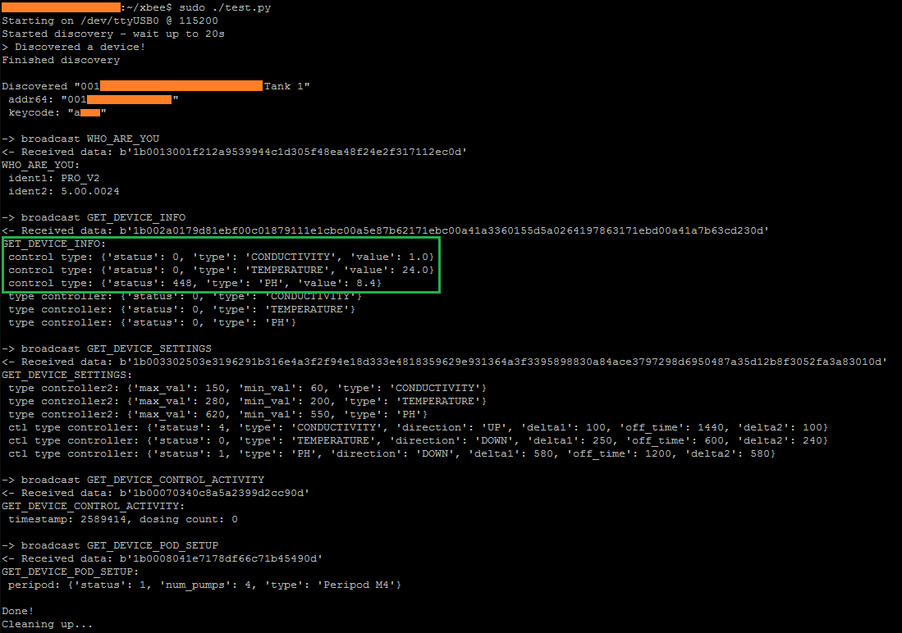

# OpenBluelabConnect 

## What Is This?
This is a proof of concept for how to connect to Bluelab hardware using a `Connect Stick` and python, and read some sensor values. 

It makes use of the XOR key found in the `Bluelab Connect` software (`[0x6e, 0x67, 0xc5, 0x79, 0xdd, 0x61, 0x02, 0x1a]`). Each packet sent contains a randomly generated byte, which the Bluelab device uses to permute the key. We do the same on reception in order to decode these "obfuscated packets". 

Currently, it broadcasts a select few commands, decodes the responses, prints some info to the screen, and exits.

Here is what the output looks like (the script has since been renamed from test.py to openbluelabconnect.py):

Currently, it will:
- discover a Bluelab devices in the area (may work with more than one, this is untested)
- determine that device's "keycode" from the 64-bit Xbee address (involves lots of shifting and base36 [yes, base36])
- identify the device (model & firmware version) (WHO_ARE_YOU)
- read and print:
  - sensor values (GET_DEVICE_INFO)
  - min/max setpoints for pumps (GET_DEVICE_SETTINGS)
  - dosing count (GET_DEVICE_CONTROL_ACTIVITY)
  - pod setup (# of pumps, type) (GET_DEVICE_POD_SETUP)

I used decompiler.com (no affiliation, it just happened to work well) to decompile the Bluelab Connect `.jar`, then spent some time analyzing and refactoring the code to understand the packet structure and what packet contents were important. This (incomplete) refactored code is available in the repo. There were some issues with case sensitivity (A.class and a.class can't coexist on Windows, which required switching to Ubuntu) and during refactoring, so the project won't build. Although with some work it probably could. There are a number of dependencies that I didn't include.

The eventual goal was to be able to read sensor values, alarms, and change setpoints. I'd really love to see an MQTT interface, or a simple CSV logger without needing Java.

This was tested with a single `Pro Controller`, a `Connect Stick`, and `Ubuntu 18.04`.

You will need the following dependencies: `pip install pyserial xbee libscrc`.

## Why?
Mostly for the fun of it - I like to take things apart. I wanted to see if I could talk to some Bluelab hardware that I had access to. Plus this was an excellent Java learning experience.

Also, in an admittedly small capacity, I was hoping to get a foot in the door at Bluelab, and get a tour if ever I visit New Zealand. So far, no luck on this front... 

Hopefully someone else finds this code useful! I don't have access to hardware any more, but I would be happy to help if someone else had some kit they wanted to experiment on.

## What This Isn't
A good example of python... Please be kind! I am new to python. This should be rewritten for any serious work.

This also isn't for beginners. At the very least, the serial port will need to be changed to match your setup. At worst, it won't work at all.

This likely only works with a `Pro Controller`. The base commands "who are you", "d1/2/3", etc. seem to apply to all devices. However not all devices have pumps (eg. Bluelab Guardian Monitor). At least one device returns tab-delimited data over RF instead of binary packets.

## To Do
- [x] proof of concept working
- [ ] fully decode packet structure and translate to python (or finish reversing Bluelab Connect and get it to build)
- [ ] update packet building code to handle data (variable length) (possibly xor'd too)
- [ ] test with more types of devices
- [ ] be able to change setpoints and peripod settings
- [ ] test with multiple devices connected to one stick
- [ ] daemonize, connect, and keep reading (maybe log/expose some api)
- [ ] mqtt frontend

## Contact
To get in touch, send an email to jordan [at] skoba [dot] ca